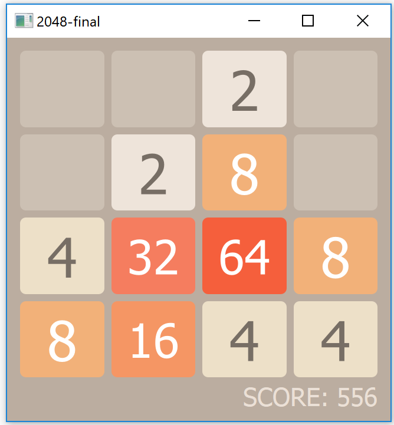

2048
====

A C++/Qt clone of the popular 2048 game. 

Game logic is written in C++, the GUI in Qt 5.2.0. The entire GUI is written in code, Qt Creator's UI designer was not used.

The core is decoupled from the GUI using the **observer pattern**, so it is easy to pull the code, extract the core and then build a new GUI around it.

Screenshot
--

Build instructions
--
1. Download and install Qt (https://download.qt.io/archive/qt/5.2/5.2.0/)
2. Open Qt Creator, File > Open File or Project... > Locate `2048-final.pro` and select it
3. Build project
4. Run

Author
--
Deepak Aggarwal